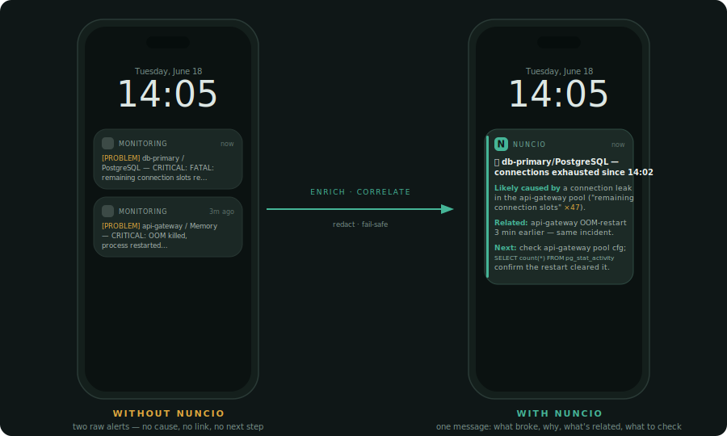
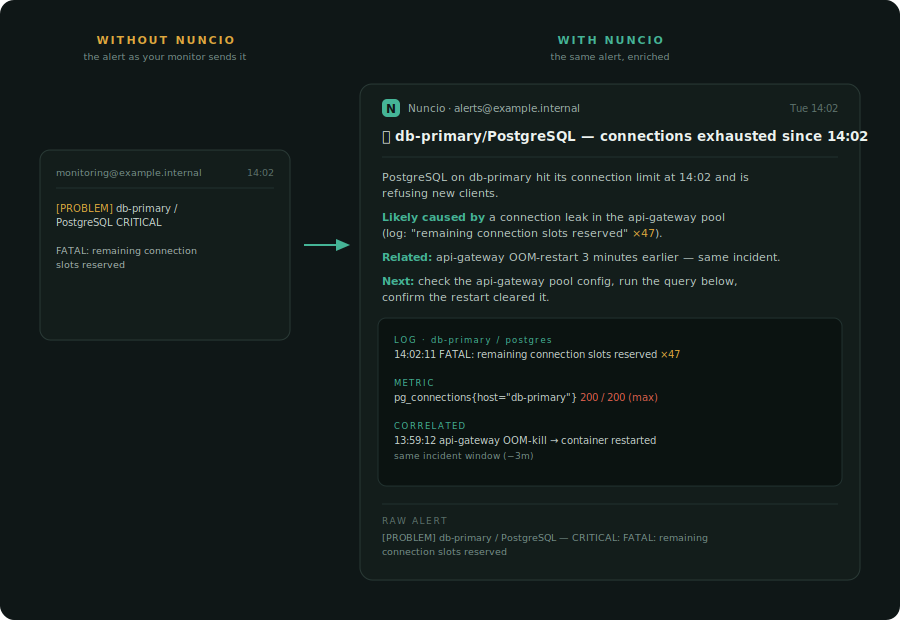
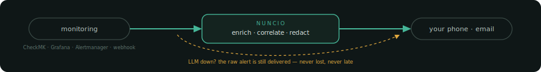
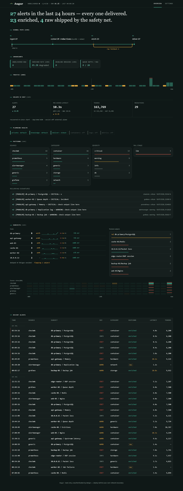
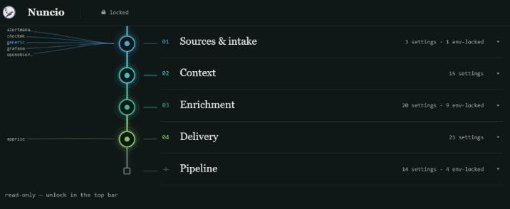

<p align="center">
  
</p>

<h1 align="center">Nuncio</h1>

<p align="center">
  <a href="https://github.com/kiarta-labs/nuncio/actions/workflows/ci.yml"></a>
  
</p>

<p align="center">Nuncio takes a monitoring alert, asks an LLM to summarize it and add context, and forwards the result. If the LLM is slow or unavailable, it forwards the raw alert instead, so an alert is never dropped or delayed.</p>

<p align="center">
  
</p>

---

Nuncio sits between your monitoring stack and wherever you want to be notified. It receives a webhook from CheckMK, Grafana, Alertmanager, OpenObserve, or a generic JSON webhook, asks an LLM to summarize and add context, and forwards the result to Apprise, ntfy, Telegram, Slack, a generic webhook, or stdout.

The design rule is that an alert is never silently lost and never held up waiting on an LLM. If the LLM is slow, unreachable, or returns something unusable, Nuncio delivers the raw alert instead, within a per-alert deadline. See [Fail-safe design](#fail-safe-design--privacy).

## Why

Raw alert text is usually terse: a host name, a metric, a threshold. Nuncio turns that into a short summary with a likely cause and next steps, using whatever extra context is available (recent logs, related alerts, container state). The goal is to shorten the gap between "a monitor fired" and "I know what happened," without adding a new way for alerting to fail.

## What an enriched alert looks like

An enriched alert has a consistent shape: a one-line summary, a plain-language likely cause with the evidence behind it, a correlation line only when a genuinely related alert exists, and the concrete next checks. Severity is shown as a colored glyph (`‼️`/`🟡`/`🔵`/`✅`) rather than a line of text.

<p align="center">
  
</p>

On email and other full-detail channels, the same body is followed by an evidence block (the log excerpt, the metric, the correlated alert the analysis is based on) and the untouched raw alert at the bottom. On a phone the push stays short. Enrichment depth is configurable: the default `full` mode runs a bounded two-pass correlate-then-analyze pipeline over recent alert history; `low` is a single call. In either mode, if the model does not answer within the deadline, the raw alert is delivered.

Source adapters feed the analysis with the structured context the native alert already carries: a CheckMK long-output excerpt and performance data, a Grafana evaluated value and its links, an OpenObserve matched-row excerpt with the firing query. Each field is capped to a conservative size, and every value is treated as data to analyze, never as an instruction to follow, regardless of which field it arrived in (see [docs/CONFIGURATION.md](docs/CONFIGURATION.md#extra-field-enrichment)).

## Features

- **Alert sources**: CheckMK, Grafana, Prometheus Alertmanager, OpenObserve, and a generic JSON webhook. The CheckMK, Grafana, and OpenObserve adapters also pass a fixed, allowlisted set of extra context fields (log excerpts, performance data, evaluated values, links) into enrichment when the payload has them, each length-capped and treated as data. Add your own in about 20 lines (see [docs/SOURCES.md](docs/SOURCES.md)).
- **Delivery**: Apprise, ntfy, Telegram, Slack, a generic webhook, or stdout. Fan out to several at once.
- **Structured enrichment**: the LLM returns a structured object (summary, likely cause, correlation, checks) that Nuncio renders itself, so output is consistent regardless of the model. Structured output is requested where the endpoint supports it and falls back cleanly where it does not.
- **Provider-agnostic LLM client**: any OpenAI-compatible chat-completions endpoint (a local Ollama, a self-hosted gateway, or a cloud provider). Switching providers is a config change.
- **Fail-safe delivery**: the default `enriched` mode ships exactly one message per alert, the enriched result on success or the marked raw alert on any failure or timeout, without relying on an external watchdog.
- **Secret redaction and privacy routing**: outbound payloads are scrubbed of credentials, tokens, and keys before they leave the process. An optional second "knowledge plane" LLM can handle non-sensitive alert categories while a private or local model handles the rest.
- **Self-contained web dashboard**: a single HTML page (no build step, no CDN) showing recent alerts, delivery outcomes, and collector health.
- **No third-party Python dependencies**: the standard library only.

## Quickstart

A prebuilt image is published to the GitHub Container Registry:

```bash
docker run -d \
  --name nuncio \
  -p 8095:8095 \
  -v $(pwd)/data:/data \
  -e NUNCIO_LLM_URL=http://your-llm-gateway:11434/v1 \
  -e NUNCIO_LLM_MODEL=your-model \
  ghcr.io/kiarta-labs/nuncio:latest
```

Or with the included compose file:

```bash
cp docker-compose.example.yml docker-compose.yml
cp .env.example .env   # edit NUNCIO_LLM_URL at minimum
docker compose up -d
```

To build from source instead (the image is small and has no dependencies to resolve):

```bash
git clone https://github.com/kiarta-labs/nuncio.git
cd nuncio
docker build -t nuncio .
```

`NUNCIO_LLM_URL` is the only required setting. Everything else has a default: delivery defaults to `stdout`, and every optional collector backend defaults to a no-op. Point a monitoring tool's webhook at `http://<host>:8095/ingest/<source>` (for example `/ingest/checkmk`, `/ingest/grafana`, or plain `/ingest` for the generic adapter).

The dashboard is at `http://<host>:8095/`.

## The pluggable model

Nuncio's core (ingest, redact, enrich, render, deliver) never imports a specific source or delivery adapter directly; it looks them up by name in a small registry. Adding one is a self-contained module plus a one-line registration:

```python
from nuncio.sources import SourceAdapter, register

@register
class MySource(SourceAdapter):
    name = "mytool"  # becomes POST /ingest/mytool

    def parse(self, payload: dict, headers: dict) -> list[dict]:
        return [{
            "host": payload["host"],
            "service": payload["check"],
            "state": payload["status"],
            "output": payload["message"],
            "timestamp": payload["time"],
        }]
```

Point `NUNCIO_EXTRA_SOURCES=mypackage.mysource` at it and it is wired in at startup, no fork required. Delivery adapters follow the same pattern; see [docs/SOURCES.md](docs/SOURCES.md) and [docs/DELIVERY.md](docs/DELIVERY.md).

## Fail-safe design & privacy

<p align="center">
  
</p>

- **Delivery modes** (`NUNCIO_MODE`): `enriched` (default) waits for the LLM and delivers the enriched message, falling back to the raw alert within the per-alert deadline on any failure or timeout, exactly one message either way. `bypass` skips enrichment and delivers the raw alert as a pass-through.
- **Redaction** runs on every outbound payload, on both the private and knowledge planes, before anything leaves the process. API keys, tokens, passwords, private keys, and JWTs are replaced with a typed placeholder.
- **Privacy-plane routing** is on by default and shares the private plane's endpoint, model, and key unless you point it elsewhere. A classification table can route specific non-sensitive alert categories to a second knowledge-plane LLM while everything else stays private. Knowledge-plane calls are anonymized: only a generic, identifier-free problem-class description is sent, never alert text, hostnames, or identifiers. It can be disabled or repointed (see [docs/CONFIGURATION.md](docs/CONFIGURATION.md)).
- **Idempotency**: alerts are deduplicated and persisted before acknowledgement, so a crash or restart mid-flight does not drop one.

## Configuration

Full reference: [docs/CONFIGURATION.md](docs/CONFIGURATION.md). See also [.env.example](.env.example) and [config.example.json](config.example.json) for templates.

## Dashboard

A read-only view of recent alerts, delivery outcomes, and collector health, served as a single self-contained HTML page. It shows the delivery-path counters (alerts in, enriched vs. shipped raw, queue depth, deadline breaches), per-subject insight (which hosts are noisiest, which subjects are flapping, and a source-by-time heatmap that shows one incident hitting several sources at once), and a ledger of recent alerts.

<p align="center">
  
</p>

The dashboard has no built-in authentication. Put it behind a reverse proxy or IP allowlist if you expose it beyond your own machine.

## Settings screen

`GET /settings` is a second self-contained page for viewing and live-editing most `NUNCIO_*` settings without a restart. `GET /settings.json` is its machine-readable counterpart.

The page lays the settings out as a pipeline rather than a flat form: a rail with five stages (**Sources & intake**, **Context**, **Enrichment**, **Delivery**, and **Pipeline** for global settings) in the order an alert moves through Nuncio. Click a stage to open an inline section with the settings that stage owns. Each setting is assigned to its stage on the server, not just grouped visually in the template.

<p align="center">
  
</p>

Each stage node has a per-stage color, and a live "world column" on either side of the rail draws fan-in curves from the currently registered source adapters and fan-out curves to the currently configured delivery channels; the fan-out redraws when you apply a delivery change. A stage's color is overridden when it is unhealthy, so a warning or critical state on a stage stands out before you open it.

- **Three-state topbar lock.** The page opens read-only; entering the admin token unlocks editing. Token entry validates through the existing settings write path, so there is no separate auth endpoint. With no `NUNCIO_ADMIN_TOKEN` configured, the page stays read-only regardless of what is typed.
- **Reads are always open.** Like the dashboard, `GET /settings` and `GET /settings.json` need no authentication, and every secret-valued field is rendered masked (`«set»`/`«unset»`).
- **Writes are fail-closed.** `POST /settings` requires `NUNCIO_ADMIN_TOKEN` to be set; with no token configured, writes are refused (403). With a token set, a matching `X-Admin-Token` header is required (401 otherwise), compared in constant time.
- **Some settings can never be changed via this API**, even with a valid token, most importantly the LLM endpoints (`NUNCIO_LLM_URL`/`_KEY`, `NUNCIO_KNOWLEDGE_URL`/`_KEY`) and `NUNCIO_ADMIN_TOKEN` itself. These stay environment-only so a misused admin token cannot repoint where alert content goes. The screen shows them read-only with a lock glyph and a tooltip explaining why. Every other setting has a tooltip with plain-language help.
- Edits queue per stage, and a single page-level apply bar posts every changed field in one request, so a multi-field change applies atomically.
- Changes are saved to `settings-overrides.json` in `NUNCIO_DATA_DIR` and take effect immediately for live settings (delivery routing, mode, timeouts, redaction rules). A small set of restart-only settings (concurrency, queue size, bind address/port) are saved but apply on the next restart, flagged as such.
- **Precedence:** overrides file > environment > built-in default. The source of each value (`default`/`env`/`override`) is shown per field.
- `NUNCIO_REDACT_EXTRA_RULES`: inline, live-editable redaction rules (`{"type", "regex"}`), additive on top of the built-in catalog and any `NUNCIO_REDACT_EXTRA` file rules. This is settings-screen-only; use `NUNCIO_REDACT_EXTRA` for a file-based rule set.

As with the dashboard, put Nuncio behind a reverse proxy or IP allowlist if you expose it beyond your own machine. The admin token protects writes, not the visibility of the settings shape on an unauthenticated GET.

## Development

```bash
pip install -e ".[dev]"
python -m pytest -q
```

`pip install -e ".[dev]"` installs `pytest-cov` alongside `pytest`. CI runs the suite with coverage across Python 3.11–3.14 and enforces a 90% minimum.

## License

[MIT](LICENSE)
